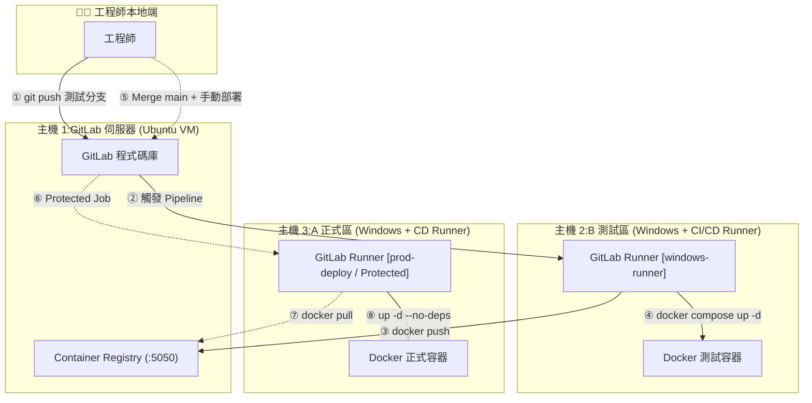
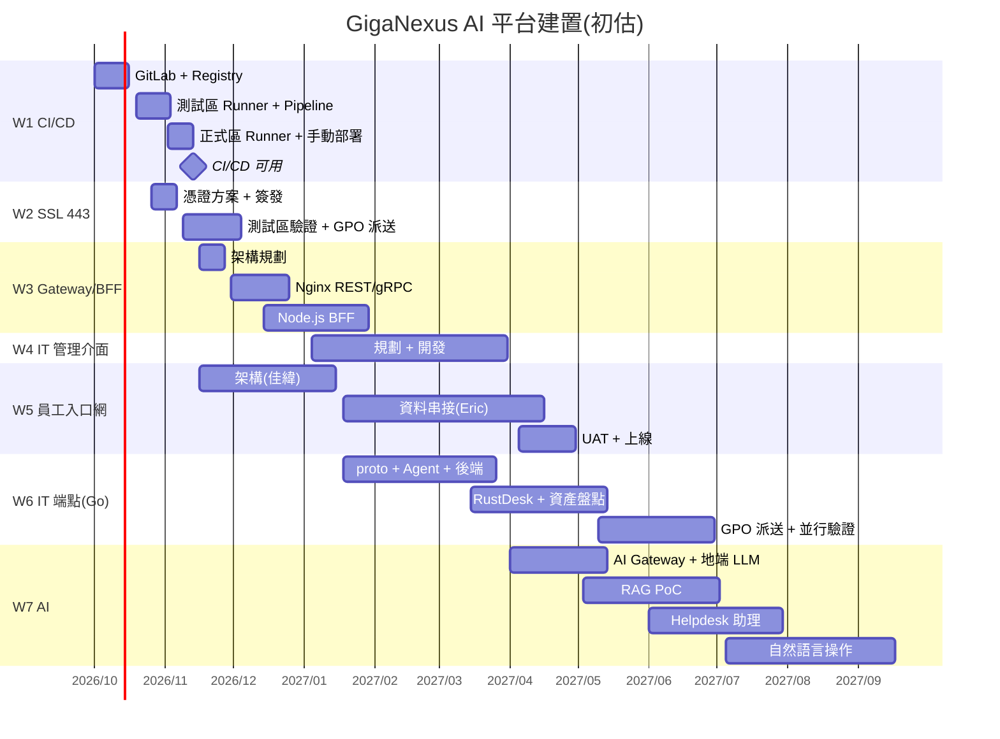

# NexusPlan — GigaNexus AI 平台建置進度甘特圖

> 把「從 WebForm 走向 AI-Ready 平台」的建置路線，變成一張可編輯、可隨時更新進度、可在會議中直接開來報告的甘特圖。

---

## 1. 文件資訊

| 項目 | 內容 |
| --- | --- |
| 產品名稱 | NexusPlan(GigaNexus AI 平台建置甘特圖) |
| 文件版本 | v0.1(初稿) |
| 建立日期 | 2026-09-24 |
| 技術棧 | Vue 3 + Vite + TypeScript ／ 地端 SQLite(本機輕量服務) |
| 規劃依據 | `CanvasUI/presentation/index.html`(AI-Ready 平台提案簡報)、`archatlas/docs/PRD.md` |
| 狀態 | 規劃中 |

---

## 2. 產品概述

NexusPlan 是一個**部署在本機、可從區網存取的甘特圖工具**,專門追蹤「AI-Ready 平台」提案中的各項建置工作:從 CI/CD 基礎架構、SSL、API Gateway/BFF,到 IT 管理介面、員工入口網、IT 端點 Agent,以及最後的 AI 功能導入。

它解決兩件事:

- **日常**:在這台電腦上直接拖曳甘特條、更新百分比、補上進度備註。
- **報告**:需要做進度報告時,用筆電連到這台電腦的 IP,即可開啟同一份甘特圖現場展示。

核心原則:**資料只存在這台電腦的地端資料庫,不連線公司資料庫,不依賴任何雲端服務。**

---

## 3. 背景與問題

- 提案簡報已有四階段路線圖(Phase 0–3),但只是靜態畫面,無法反映實際進度。
- 工作項目橫跨基礎建設、資安憑證、閘道、三個前端、Go 後端與 AI,彼此有前後相依(例如:CI/CD 未完成,後續服務無法自動部署)。
- 參與人員不只一位(佳緯、Eric 與提案人),需要清楚標示負責人與交接點。
- 進度報告時常需要臨時打開最新狀態,若資料只在瀏覽器 LocalStorage,換一台筆電就看不到。

**痛點總結:** 計畫「有藍圖、沒有追蹤」,且報告時資料不易帶著走。

---

## 4. 目標與成功指標

### 4.1 產品目標

1. 以甘特圖完整呈現 7 大工作流(見 §8)與其子任務、相依、里程碑。
2. 任務可**直接在圖上編輯**:拖曳調整日期、拖曳調整進度、新增/刪除任務。
3. 資料**存放於本機地端資料庫**,重開機、換瀏覽器都不會遺失。
4. 同一區網內的筆電可透過 `http://<本機IP>:<port>` 開啟並操作。

### 4.2 成功指標(驗收標準)

| 指標 | 目標 |
| --- | --- |
| 更新一筆進度 | 3 次點擊 / 10 秒內完成 |
| 區網存取 | 筆電以 IP 連線,首次載入 < 2 秒 |
| 資料一致性 | 本機與筆電看到的是同一份資料(重新整理即同步) |
| 資料安全 | 每日自動備份;可一鍵匯出 / 匯入 JSON |
| 報告可用性 | 一鍵切換「報告模式」,投影時不需另外製作簡報 |

---

## 5. 目標受眾

| 角色 | 需求 |
| --- | --- |
| 提案人 / 架構負責人(本機使用者) | 規劃任務、調整排程、更新進度、做進度報告 |
| 開發成員(佳緯、Eric) | 查看自己的任務與交接時間點,回報進度 |
| 主管(報告對象) | 快速看懂整體完成度、延遲項目與下一個里程碑 |

---

## 6. 核心功能

### 6.1 甘特圖檢視(核心)

- 左側為**任務樹**(工作流 → 任務 → 子任務),右側為時間軸甘特條。
- 時間刻度可切換:**日 / 週 / 月 / 季**。
- 顯示**今日線**、**里程碑(菱形)**、**相依箭頭**(Finish-to-Start)。
- 甘特條以工作流上色,並以內部填色顯示完成百分比。
- **延遲標示**:今天已超過預期進度(依時間比例計算)的任務以警示色標記。
- 工作流可收合/展開;可依負責人、狀態篩選。

### 6.2 甘特圖編輯

- **拖曳**甘特條移動日期;拖曳左右邊緣調整起訖。
- **拖曳**進度把手調整完成百分比。
- 拖曳建立相依關係;移動前置任務時提示是否連動後續任務。
- 點擊任務開啟**編輯側欄**:名稱、工作流、負責人、起訖日、進度、狀態、優先度、說明、相關連結。
- 新增 / 刪除 / 複製任務;上下拖曳調整排序與層級。
- **復原 / 重做**(Ctrl+Z / Ctrl+Y)。

### 6.3 進度更新與紀錄

- 每次更新進度可附一段**進度備註**(例如:「Runner B 已註冊,tag: windows-runner」)。
- 系統保留**進度歷程**(時間、舊值 → 新值、備註),可在任務側欄查看。
- 狀態:`未開始 / 進行中 / 卡關 / 已完成 / 暫緩`;「卡關」需填原因。

### 6.4 報告模式

- 一鍵切換為唯讀、全螢幕、大字體版面,隱藏編輯控制項。
- 頂部顯示**總覽卡片**:整體完成度、各工作流完成度、延遲任務數、下一個里程碑。
- 可選擇報告區間(例如:本月 / 本季),自動捲動至今日。
- **本期更新摘要**:列出指定日期後有變更的任務與備註,方便週報/月報。
- 匯出:PNG(甘特圖截圖)、PDF(列印版面)、CSV。

### 6.5 資料管理

- 資料存於本機 **SQLite** 單一檔案(`data/nexusplan.db`)。
- **JSON 匯出 / 匯入**(整份計畫),便於備份與版本比對。
- 啟動時與每日自動備份至 `data/backup/`(保留最近 30 份)。
- 首次啟動自動載入 §8 的**初始計畫種子資料**。

### 6.6 區網存取

- 服務綁定 `0.0.0.0`,筆電可用 `http://<本機IP>:5190` 連線。
- 首頁右上角顯示本機區網 IP 與 QR Code,方便筆電/手機快速開啟。
- **編輯保護(選用)**:設定編輯 PIN;未輸入 PIN 的連線為唯讀,避免會議中誤改。
- 多裝置同時開啟時,以「最後寫入為準」並顯示更新時間;畫面每 30 秒或切回分頁時自動重新載入。

---

## 7. 使用者情境(User Stories)

- **作為提案人**,我希望每週五在這台電腦上拖一拖甘特條、填上進度備註,這樣週報時資料就是最新的。
- **作為提案人**,我希望帶筆電進會議室,連到這台電腦的 IP 就能直接開報告模式,不用另外做投影片。
- **作為主管**,我希望一眼看到哪些工作延遲、下一個里程碑是什麼,這樣我能判斷是否需要調整資源。
- **作為佳緯**,我希望清楚看到「員工入口網架構」完成後要接手「IT 端點 Agent」,以及交給 Eric 的時間點。
- **作為 Eric**,我希望看到我負責的資料串接何時可以開始、前置條件是什麼。

---

## 8. 初始計畫(甘特圖種子資料)

> 起始日以 **2026-10-01** 估算,對應簡報 Roadmap:Phase 0(0–3 月)打地基、Phase 1(3–6 月)知識 AI、Phase 2(6–12 月)辦公 AI。日期皆為初估,可於甘特圖中直接調整。

### 8.1 工作流總表

| # | 工作流 | 負責人 | 預計期間 | 前置 | 對應 Phase |
| --- | --- | --- | --- | --- | --- |
| W1 | CI/CD 基礎架構(GitLab + Registry + 雙 Runner) | 提案人 | 2026-10-01 ~ 2026-11-13 | — | Phase 0 |
| W2 | AD 網域 443 / SSL 測試與派送 | 提案人 | 2026-10-26 ~ 2026-12-04 | W1(部分) | Phase 0 |
| W3 | API Gateway + BFF 架構規劃與開發 | 提案人 | 2026-11-16 ~ 2027-01-29 | W1、W2 | Phase 0 |
| W4 | IT 管理介面規劃與開發 | 提案人 | 2027-01-04 ~ 2027-03-31 | W3 | Phase 1 |
| W5 | 員工入口網架構規劃與開發 | 佳緯(架構)→ Eric(資料串接) | 2026-11-16 ~ 2027-04-30 | W3 | Phase 0–1 |
| W6 | IT 端點 Agent + 後端主機(Go + gRPC) | 佳緯 | 2027-01-18 ~ 2027-06-30 | W5 架構完成、W3 | Phase 1–2 |
| W7 | W5 / W6 加入 AI 功能 | 提案人 + 佳緯 + Eric | 2027-04-01 ~ 2027-09-30 | W5、W6 | Phase 1–2 |

### 8.2 子任務明細

**W1. CI/CD 基礎架構**(依下列部署流程圖)



| 子任務 | 預計期間 | 產出 / 完成定義 |
| --- | --- | --- |
| W1-1 主機 1:Ubuntu VM 建置、GitLab 安裝 | 10/01 ~ 10/09 | GitLab 網頁可登入,建立群組與專案 |
| W1-2 Container Registry(:5050)啟用 | 10/12 ~ 10/16 | `docker login` / `push` / `pull` 驗證成功 |
| W1-3 主機 2:B 測試區 Runner 註冊(`windows-runner`) | 10/19 ~ 10/23 | Runner 在線,可接 Job |
| W1-4 測試分支 Pipeline:建置 → 推送 → 本機重啟 | 10/26 ~ 11/03 | 步驟 ①–④ 全自動跑通 |
| W1-5 主機 3:A 正式區 Runner(`prod-deploy`、Protected) | 11/02 ~ 11/06 | 僅 protected branch 可派送 |
| W1-6 main 手動核可部署 + 平滑重啟 | 11/09 ~ 11/13 | 步驟 ⑤–⑧ 跑通,無 SSH、無私鑰 |
| ◆ 里程碑:CI/CD 可用 | 11/13 | 範例服務完成一次測試→正式部署 |

**W2. AD 網域 443 / SSL**

| 子任務 | 預計期間 | 產出 / 完成定義 |
| --- | --- | --- |
| W2-1 憑證方案確認(AD CS 企業 CA / 公司憑證) | 10/26 ~ 10/30 | 憑證來源、網域名稱、SAN 清單定案 |
| W2-2 申請 / 簽發伺服器憑證 | 11/02 ~ 11/06 | GitLab、Registry、Gateway 憑證 |
| W2-3 測試區套用 443 並驗證 | 11/09 ~ 11/20 | 瀏覽器、Docker、Runner 皆信任憑證 |
| W2-4 GPO 派送根憑證至網域電腦 | 11/23 ~ 12/04 | 抽測網域電腦無憑證警告 |
| ◆ 里程碑:網域內全面 443 | 12/04 | — |

**W3. API Gateway + BFF**(Nginx;IT 端點走 gRPC)

| 子任務 | 預計期間 | 產出 / 完成定義 |
| --- | --- | --- |
| W3-1 架構規劃:路由表、認證流程、服務邊界 | 11/16 ~ 11/27 | 架構文件 + ArchAtlas 更新 |
| W3-2 Nginx Gateway:443 SSL、REST 路由、WebSocket | 11/30 ~ 12/18 | 反向代理上線(測試區) |
| W3-3 Nginx gRPC 代理(`grpc_pass`,HTTP/2) | 12/07 ~ 12/25 | Agent ↔ 後端 gRPC 經 Gateway 可通 |
| W3-4 Node.js BFF:AD/LDAP 登入、JWT、RBAC | 12/14 ~ 2027/01/15 | 登入、權限範例 API |
| W3-5 BFF API 聚合與通知(LINE / Email)骨架 | 01/11 ~ 01/29 | 可供 W4、W5 前端呼叫 |
| ◆ 里程碑:Gateway + BFF 可用 | 2027/01/29 | 走 W1 Pipeline 部署 |

**W4. IT 管理介面**(未來由 BFF 與 IT 端點共同維護)

| 子任務 | 預計期間 | 產出 / 完成定義 |
| --- | --- | --- |
| W4-1 需求與畫面規劃(沿用 Canvas UI 設計系統) | 01/04 ~ 01/15 | 頁面清單、線框 |
| W4-2 端點清單 / 搜尋 / 狀態頁 | 01/18 ~ 02/12 | 搜尋姓名、工號、電腦名稱 |
| W4-3 資產明細、告警頁 | 02/15 ~ 03/12 | 串 W6 資料(先用 mock) |
| W4-4 一鍵遠端協助、操作稽核紀錄 | 03/08 ~ 03/31 | 串 RustDesk,留存紀錄 |

**W5. 員工入口網**

| 子任務 | 負責 | 預計期間 | 產出 / 完成定義 |
| --- | --- | --- | --- |
| W5-1 前後端架構規劃 | 佳緯 | 11/16 ~ 11/27 | 架構文件 |
| W5-2 前端架構(Canvas UI 移植、路由、狀態、API 層) | 佳緯 | 11/30 ~ 12/31 | 可部署骨架 |
| W5-3 後端架構(經 BFF、SSO 整合) | 佳緯 | 12/14 ~ 2027/01/15 | 登入後可進入首頁 |
| ◆ 交接:架構完成 → 佳緯轉 W6、資料交 Eric | — | 2027/01/15 | 交接文件、範例 API |
| W5-4 資料串接(人事、薪資、行政資源、公告…) | Eric | 01/18 ~ 04/16 | 逐頁由 mock 換成真實 API |
| W5-5 測試、UAT、上線取代 PortalSolar | Eric | 04/05 ~ 04/30 | 正式上線 |

**W6. IT 端點 Agent + 後端主機**(Go + gRPC,類 SmartIT)

| 子任務 | 預計期間 | 產出 / 完成定義 |
| --- | --- | --- |
| W6-1 gRPC 協定(proto)與後端主機架構 | 01/18 ~ 01/29 | proto 定版 |
| W6-2 Go Agent(Windows 服務):心跳、AD 帳號、電腦名稱、IP | 02/01 ~ 03/05 | 開機自動回報 |
| W6-3 後端主機:端點註冊、狀態儲存、查詢 API | 02/15 ~ 03/26 | 供 W4 管理介面使用 |
| W6-4 自建 RustDesk 整合、一鍵遠端協助 | 03/15 ~ 04/16 | 30 秒內連上 |
| W6-5 軟硬體資產盤點 | 04/12 ~ 05/14 | CPU / RAM / 硬碟 / 軟體 |
| W6-6 GPO 派送 Agent、mTLS、與 SmartIT 並行驗證 | 05/10 ~ 06/30 | 試點部門全數上線 |
| ◆ 里程碑:端點管理試點完成 | 2027/06/30 | — |

**W7. AI 功能(W5 / W6)**

| 子任務 | 預計期間 | 產出 / 完成定義 |
| --- | --- | --- |
| W7-1 AI Gateway(模型路由、配額、稽核)+ 地端 LLM | 04/01 ~ 05/14 | 可稽核的 LLM 呼叫 |
| W7-2 入口網 RAG 知識庫 PoC(1 個部門,依 AD 權限過濾) | 05/03 ~ 07/02 | 附出處回答 |
| W7-3 IT Helpdesk 助理(讀 Agent 狀態初步診斷) | 06/01 ~ 07/30 | 「電腦很慢」可給初步診斷 |
| W7-4 入口網自然語言操作(預約、查詢) | 07/05 ~ 09/17 | 送出前需本人確認 |
| ◆ 里程碑:Phase 1 RAG PoC 驗收 | 2027/07/02 | 簡報中的評估依據 |

### 8.3 甘特圖預覽



---

## 9. 技術架構

### 9.1 架構決策:為何需要本機輕量服務

需求是「Vue + 地端資料庫、不連公司資料庫」且「筆電要能用 IP 連進來看」。

- 若只用瀏覽器 IndexedDB / LocalStorage,**資料存在各自的瀏覽器**,筆電連進來會看到空的計畫。
- 因此採用**單一 Node.js 程序**同時負責:提供 Vue 靜態頁面 + 少量 REST API + 讀寫本機 SQLite 檔案。
- 此服務只跑在這台電腦上,不連任何外部或公司資料庫,屬「地端單機」架構。

```
筆電瀏覽器 ──http://<本機IP>:5190──┐
本機瀏覽器 ──http://localhost:5190─┤
                                    ▼
                  Node.js(Fastify)0.0.0.0:5190
                   ├─ /          → Vue SPA(dist 靜態檔)
                   └─ /api/*     → REST API
                                    ▼
                         data/nexusplan.db(SQLite)
```

### 9.2 技術棧

| 層級 | 技術 | 用途 |
| --- | --- | --- |
| 前端框架 | **Vue 3**(`<script setup>` + Composition API)+ TypeScript | 主要 UI |
| 建置 | **Vite** | 開發伺服器(`--host`)與打包 |
| 狀態管理 | **Pinia** | 任務、篩選、復原/重做堆疊 |
| 甘特圖 | **自繪元件**(Vue + SVG,已定案;Frappe Gantt 無法完整支援工作流分組與連動順延) | 拖曳、進度把手、相依箭頭 |
| UI 元件 | 沿用 **Canvas UI** 設計 Token(或 Naive UI) | 與員工入口網風格一致 |
| 後端 | **Node.js + Fastify** | 靜態檔 + REST API |
| 資料庫 | **SQLite**(Node 內建 `node:sqlite`,免編譯) | 單檔地端資料庫,易備份 |
| 匯出 | html-to-image / 瀏覽器列印 | PNG、PDF |
| 程式品質 | ESLint + Prettier | — |

### 9.3 資料模型(初步)

```jsonc
{
  "workstreams": [
    { "id": "W1", "name": "CI/CD 基礎架構", "color": "#2563eb", "sort": 1 }
  ],
  "tasks": [
    {
      "id": "W1-4",
      "workstreamId": "W1",
      "parentId": null,              // 子任務層級
      "name": "測試分支 Pipeline:建置 → 推送 → 本機重啟",
      "owner": "提案人",
      "start": "2026-10-26",
      "end": "2026-11-03",
      "progress": 40,                // 0–100
      "status": "in_progress",       // todo | in_progress | blocked | done | on_hold
      "type": "task",                // task | milestone
      "priority": "high",
      "description": "步驟 ①–④ 全自動跑通",
      "links": ["https://gitlab.local/..."],
      "sort": 4,
      "updatedAt": "2026-10-30T17:20:00+08:00"
    }
  ],
  "dependencies": [
    { "from": "W1-3", "to": "W1-4", "type": "FS" }
  ],
  "progressLogs": [
    { "taskId": "W1-4", "at": "2026-10-30T17:20:00+08:00", "from": 20, "to": 40, "note": "docker push 至 :5050 成功" }
  ]
}
```

### 9.4 API(初步)

| Method | Path | 說明 |
| --- | --- | --- |
| GET | `/api/plan` | 取得整份計畫(工作流、任務、相依) |
| POST / PATCH / DELETE | `/api/tasks[/:id]` | 任務增修刪 |
| POST | `/api/tasks/:id/progress` | 更新進度 + 備註(寫入歷程) |
| POST / DELETE | `/api/dependencies[/:id]` | 相依增刪 |
| GET | `/api/changes?since=YYYY-MM-DD` | 報告用:區間內變更摘要 |
| GET / POST | `/api/export`、`/api/import` | JSON 匯出 / 匯入 |
| GET | `/api/server-info` | 本機區網 IP、版本(顯示連線資訊用) |

### 9.5 部署與區網連線

- **啟動**:`npm run start` → 服務監聽 `0.0.0.0:5190`;開發時 `npm run dev` 以 `vite --host` 對區網開放。
- **防火牆**:需在本機 Windows 防火牆新增 TCP 5190 輸入規則,**範圍限定網域/私人設定檔**,不開放公用網路。(由使用者自行以系統管理員執行)

  ```powershell
  New-NetFirewallRule -DisplayName "NexusPlan 5190" -Direction Inbound -Protocol TCP -LocalPort 5190 -Action Allow -Profile Domain,Private
  ```

- **常駐**:可用 NSSM 或工作排程器設為開機自動啟動;報告期間需確認本機未進入睡眠。
- **固定 IP**:建議向 IT 申請保留 IP 或使用電腦名稱(`http://<電腦名稱>:5190`)連線。
- 未來 W1 CI/CD 完成後,可選擇改以 Docker 部署到測試區主機,成為「用自己的 Pipeline 部署的第一個服務」。

---

## 10. 非功能需求

| 項目 | 要求 |
| --- | --- |
| 效能 | 200 筆任務內拖曳流暢(60fps);首次載入 < 2 秒 |
| 可靠性 | SQLite WAL 模式;每日自動備份,保留 30 份 |
| 安全性 | 僅區網存取;防火牆限網域/私人設定檔;編輯 PIN(選用);不儲存任何帳密 |
| 響應式 | 桌面為主;筆電 1366×768 投影可完整顯示報告模式 |
| 可維護性 | 前後端同一 repo;種子資料獨立於 `seed/plan.json` |
| 可攜性 | 整個資料夾 + `nexusplan.db` 複製即可搬遷 |

---

## 11. 範圍與里程碑

### 11.1 MVP(第一階段)

- [x] Vue 3 + Vite + TS 專案骨架;Fastify + SQLite 服務
- [x] 資料模型與 §8 種子資料匯入
- [x] 甘特圖檢視:工作流分組、日/週/月刻度、今日線、里程碑
- [x] 拖曳調整日期與進度;編輯側欄
- [x] 進度備註與歷程
- [x] 綁定 0.0.0.0,筆電以 IP 連線驗證

### 11.2 第二階段

- [x] 相依箭頭建立與連動提示
- [x] 報告模式 + 總覽卡片 + 本期更新摘要
- [x] 匯出 PNG / PDF / CSV;JSON 匯出匯入
- [x] 自動備份;編輯 PIN

### 11.3 第三階段(未來)

- [ ] 基準線(Baseline)比較:原計畫 vs 實際
- [ ] 以 W1 Pipeline 容器化部署
- [ ] 與 ArchAtlas 連結:任務對應架構節點
- [ ] 從 GitLab Issue / Milestone 同步進度(選用)

---

## 12. 假設與風險

| 假設 / 風險 | 說明 | 應對 |
| --- | --- | --- |
| 甘特圖函式庫能力 | Frappe Gantt 樹狀層級與相依編輯較陽春 | 先 POC;不足時改 vue-ganttastic 或自繪 SVG |
| 本機關機 / 睡眠 | 報告時筆電連不上 | 設開機自動啟動、關閉睡眠;報告前可匯出 PDF 備援 |
| 多人同時編輯衝突 | 最後寫入覆蓋 | 顯示更新時間;以 `updatedAt` 檢查並提示重新載入 |
| IP 變動 | DHCP 換 IP 後網址失效 | 保留 IP 或以電腦名稱連線;首頁顯示目前 IP |
| 排程為初估 | §8 日期未經團隊確認 | 以甘特圖拖曳調整,並啟用 Baseline 比較 |
| 人力交接 | 佳緯從 W5 轉 W6、Eric 接手 W5 資料 | 交接設為里程碑,需有交接文件與範例 API |

---

## 13. 未來規劃

- 將 NexusPlan 本身作為 W1 CI/CD 的第一個示範服務,驗證整條 Pipeline。
- 報告模式直接嵌入 AI-Ready 提案簡報,做為「進度追蹤」頁。
- W7 完成後,加入「以一句話更新進度」與自動產生週報摘要。

---

*本文件為初稿,排程與負責人請於甘特圖建立後依實際狀況調整。*
