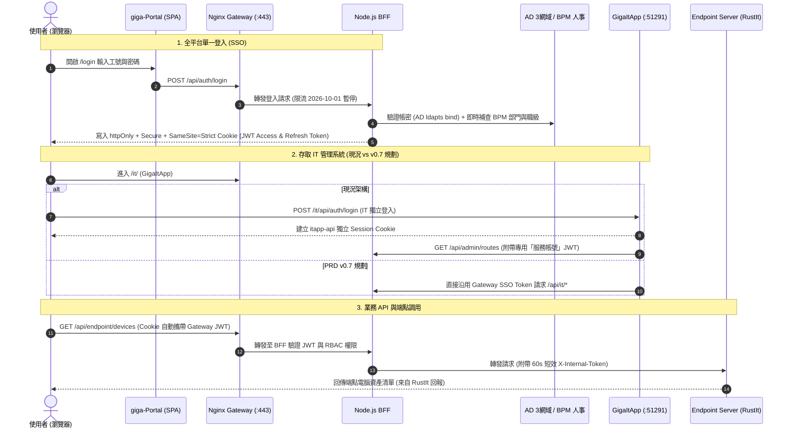
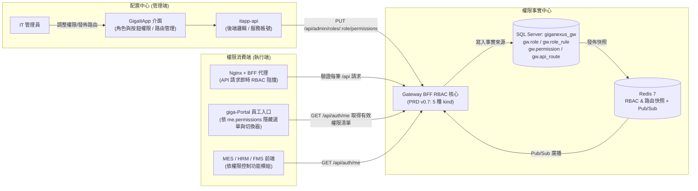
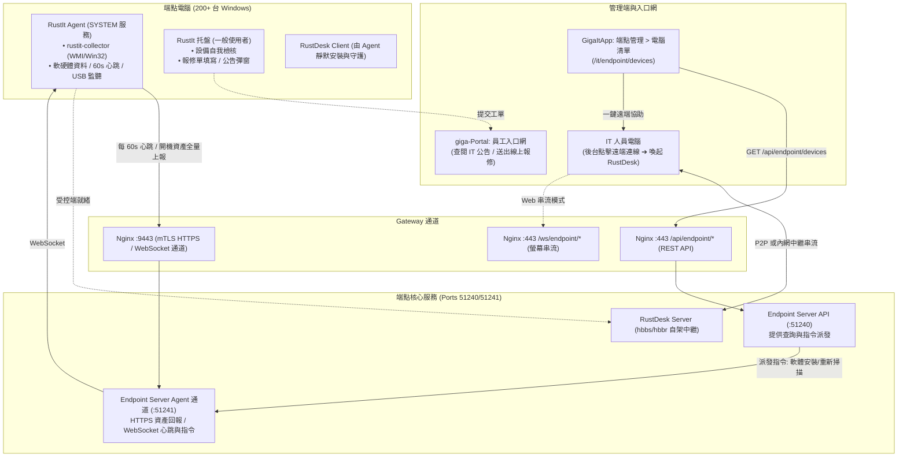

# GigaNexus 全專案架構地圖與彼此對應關係 (PROJECT-MAP)

> **最後更新**：2026-10-08(附件服務 giga-file-service 登記:規劃文件拆分為 docs/PRD 等主題文件,畫面放 GigaItApp「Gateway 管理 › 檔案管理」,甘特圖 W11。2026-10-07:通知中心 N1–N3 測試區實測通過:BFF 公告 API / 廣播 / Email、web-kit 0.3.0、GigaItApp 通知中心;公告對象限分階段開放公司;見 giga-api-gateway-bff/docs/NOTIFY-PLAN.md §11.3–§11.4。RustIt 測試區接通:Agent 經 :9443 回報 ItAgentBack,GigaItApp 電腦清單可見;見 RustIt/docs/INTEGRATION-PLAN.md M4)  
> **涵蓋專案**：`giga-api-gateway-bff` (網關與身分中心)、`giga-Portal` (員工入口網)、`GigaItApp` (IT 部門管理系統)、`RustIt` (端點資產與控管平台)、`giga-file-service` (附件服務,規劃中)  
> **上位規範**：本工作區所有專案之架構、通訊、身分、權限與介面規範以 [`giga-api-gateway-bff/docs/`](file:///d:/檔案分享/程式碼/GigaNexusAI/giga-api-gateway-bff/docs/) 為唯一上位標準（PRD v0.7）。

---

## 1. 總覽架構圖

```mermaid
flowchart TB
    %% ======================= 用戶端層 =======================
    subgraph Clients ["用戶端 (Clients)"]
        BrowserUser["一般員工瀏覽器<br/>(Portal 登入 / 個人首頁 / 待辦)"]
        BrowserIT["IT 管理員瀏覽器<br/>(GigaItApp 管理台)"]
        RustTray["RustIt 托盤 (Tray)<br/>(使用者設備自查 / 報修單 / 公告)"]
        RustAgent["RustIt Agent (Windows 服務)<br/>(200+ 台電腦 / SYSTEM 權限)"]
        ExtWebhook["外部系統回呼<br/>(BPM / LINE 暫緩)"]
    end

    %% ======================= 閘道網關層 =======================
    subgraph Gateway ["Nginx Gateway (地端唯一入口主機 IP)"]
        direction TB
        N_HTTPS[":443 HTTPS / HTTP/2 入口<br/>• SPA 靜態託管 (/srv/www/*/current)<br/>• 業務 API 反代 (/api/*)<br/>• IT 專用 API (/it/api/*，v0.7 規劃轉 /api/it/*)<br/>• 串流 WebSocket (/ws/endpoint/*)"]
        N_MTLS[":9443 Agent 專用通道<br/>• mTLS 強制驗證 (ssl_verify_client on)<br/>• HTTPS 回報 + WebSocket 指令 (長連線)"]
    end

    %% ======================= 身分與政策中心 =======================
    subgraph BFF_Cluster ["Node.js BFF (Fastify 5 叢集)"]
        AUTH["Auth 認證模組<br/>• AD 3 網域 / 本機帳號 (Argon2id)<br/>• httpOnly JWT Cookie (Access/Refresh)<br/>• 登入即時補查 BPM/LOS"]
        RBAC["動態 RBAC 核心 (6 種 kind)<br/>app / group / menu / tab / button / api<br/>畫面節點綁定 API(授予即取得)<br/>角色 ∪ 部門 ∪ 個人"]
        ROUTER["動態路由與聚合<br/>• SQL Server 路由表 + Redis 快取<br/>• 斷路器 / 限流 / GET 快取<br/>• 附加 X-Internal-Token (60s)"]
        ADMIN_API["BFF Admin API<br/>• /api/admin/* (供 GigaItApp 動態維護)<br/>• 後端自動註冊與草稿匯入<br/>• 既有路由查詢 CLI"]
        NOTIFY["通知模組<br/>Email / 站內通知 / 公告(全公司廣播、已讀回條)<br/>/ws/notify 即時推播(NOTIFY-PLAN)"]
        SYNC["人事同步模組<br/>現行登入即時向 BPM/LOS 補查<br/>(排程同步 Worker 規劃中)"]
    end

    %% ======================= 前端 SPA 專案 =======================
    subgraph Frontends ["前端 SPA (發佈至 /srv/www)"]
        PortalSPA["giga-Portal (/)<br/>員工入口網 / 單一登入頁<br/>Vue 3 + Vite (:5179)"]
        ItSPA["GigaItApp (/it/)<br/>IT 部門管理系統<br/>Vue 3 + Vite (:5177/:5178)"]
        OtherSPAs["其他業務 SPA<br/>/mes/、/hrm/、/fms/、/bi/"]
    end

    %% ======================= 共用套件層 =======================
    subgraph SharedPackages ["平台共用套件 (giga-api-gateway-bff 提供)"]
        WebKit["@giganexus/web-kit (前端套件)<br/>HTTP Client / CSRF / Token Refresh<br/>路由守衛 / /api/auth/me 型別"]
        BackendSDK["@giganexus/backend-sdk (後端 SDK)<br/>X-Internal-Token 驗證 / 後端自動註冊<br/>gw-lookup 路由查詢 CLI"]
    end

    %% ======================= 後端與微服務層 =======================
    subgraph Backends ["下游服務群 (Ports 51200–51300)"]
        ItBackend["itapp-api (:51291)<br/>Fastify 5 + TypeScript<br/>現行 /it/api/*，規劃納入 BFF /api/it/*"]
        PortalBackend["portal-api (:51271)<br/>Fastify (規劃中 M4 啟動)"]
        FileService["file-api (:51272)<br/>giga-file-service 附件服務 (規劃中)<br/>UUID 上傳下載 / BPM 附件 / 舊格式相容層"]
        EndpointServer["Endpoint Server (RustIt/ItAgentBack, Node.js + Fastify)<br/>:51240 REST / :51241 HTTPS + WebSocket<br/>端點管理 / 遠端指令 / 螢幕串流"]
        RustDeskServer["RustDesk Server (hbbs/hbbr)<br/>自架內網遠端桌面中繼"]
        MESService["Go MES (:51210)"]
        HRM_FMS["Node HRM (:51220) / FMS (:51230)"]
        BPMAdaptor["BPM 適配層 (:51250)"]
        ERPAdaptor["ERP 適配層 (:51260)"]
        BIService["BI / 報表服務 (:51280)"]
    end

    %% ======================= 端點專案 =======================
    subgraph RustItProject ["RustIt (端點資產與控管平台)"]
        Collector["rustit-collector<br/>WMI / Win32 / 登錄檔蒐集"]
        NativeApp["rustit-native (egui)<br/>原生超高效能介面 (<90MB)"]
        DemoApp["rustit-demo (Tauri)<br/>WebView2 概念展示版"]
    end

    %% ======================= 資料與目錄服務 =======================
    subgraph DataStorage ["資料儲存與目錄服務"]
        DB_GW[("SQL Server 2012<br/>giganexus_gw (路由/權限/稽核)<br/>LOS (EmployeeInfo 人事唯讀)")]
        DB_BPM[("SQL Server 2019<br/>BPM 人事組織與簽核 (唯讀)")]
        RedisCache[("Redis 7<br/>路由快照 / Session / 限流 / 佇列")]
        AD_Domain[("Windows AD (3 網域)<br/>gsc / gsmc / ygdmc")]
        DB_FILE[("附件服務儲存(規劃中)<br/>SQL Server 2012 giganexus_file<br/>WSL /srv/giga-files + NAS 備份")]
        DB_ITA[("ItAgentBack 儲存(測試區運作中)<br/>SQL Server 2012 giganexus_It_Agent (永久)<br/>MongoDB 7 (快照歷史) / Redis 7 (在線狀態)")]
    end

    %% 連線關係
    BrowserUser -->|"HTTPS :443 (/ & /api/*)"| N_HTTPS
    BrowserIT -->|"HTTPS :443 (/it/* & /it/api/*)"| N_HTTPS
    ExtWebhook -->|"HTTPS :443 (/webhook/*)"| N_HTTPS
    RustTray -.->|"報修 / 查設備"| BrowserUser
    RustAgent -->|"mTLS HTTPS / WSS :9443"| N_MTLS

    N_HTTPS -->|"/ 靜態檔"| PortalSPA
    N_HTTPS -->|"/it/ 靜態檔"| ItSPA
    N_HTTPS -->|"/mes/、/hrm/ 等"| OtherSPAs
    N_HTTPS -->|"/api/*, /ws/notify"| BFF_Cluster
    N_HTTPS -->|"/it/api/* (現況直轉)"| ItBackend
    N_HTTPS -.->|"/ws/endpoint/* (auth_request 驗證)"| EndpointServer
    N_MTLS -->|"proxy_pass (帶憑證 DN/FP)"| EndpointServer

    PortalSPA -.->|"依賴"| WebKit
    ItSPA -.->|"依賴"| WebKit
    Backends -.->|"驗證 Token / 自動註冊"| BackendSDK

    ItBackend -->|"服務帳號呼叫 /api/admin/*"| BFF_Cluster
    BFF_Cluster -->|"動態轉發 (帶 X-Internal-Token)"| Backends
    
    BFF_Cluster --> DB_GW & RedisCache
    AUTH --> AD_Domain
    AUTH -.->|登入即時補查| DB_BPM & DB_GW

    RustAgent --- Collector
    RustAgent -->|守護與設定| RustDeskServer
    EndpointServer <--> RustDeskServer
    EndpointServer --> DB_ITA
    N_HTTPS -.->|"上傳 auth_request 後直送 (規劃)"| FileService
    FileService -.-> DB_FILE
```



---

## 2. 專案矩陣與基本定位

| 專案目錄 | 專案名稱 | 定位與核心職責 | 主要技術棧 | 服務 Port 與 URL 路徑 | 上下游對應關係 |
| :--- | :--- | :--- | :--- | :--- | :--- |
| [`giga-api-gateway-bff`](file:///d:/檔案分享/程式碼/GigaNexusAI/giga-api-gateway-bff) | **GigaNexus Gateway & BFF** | • 全集團地端唯一反向代理網關<br/>• 身分驗證中心 (AD/BPM/LOS/本機)<br/>• 資料庫驅動動態路由與權限檢查點<br/>• 內部短效 JWT 發放、通知與審計<br/>• 前後端共用套件提供者 (`web-kit`, `sdk/node`) | Nginx + Node.js 22 (Fastify 5) + Drizzle ORM + Redis 7 + SQL Server 2012 | • `:443` (HTTPS/WSS)<br/>• `:9443` (Agent mTLS)<br/>• 內部叢集容器 (`bff-1`, `bff-2`) | **所有子系統的核心骨幹**<br/>所有前端 SPA 經它託管，所有業務 API 經由它做 RBAC 鑑權與轉發。 |
| [`giga-Portal`](file:///d:/檔案分享/程式碼/GigaNexusAI/giga-Portal) | **GigaNexus 員工入口網** | • 集團員工單一登入入口 (`/login`)<br/>• 首頁儀表板、待辦事項、個人資料<br/>• 跨應用切換器 (`GAppSwitcher`)<br/>• 未來 portal-api (Port 51271) 載體 | 前端: Vue 3 + Vite + TypeScript (科技綠風格)<br/>後端: `portal-api` (規劃中) | 前端: `:443/` (dev `:5179`)<br/>後端: `:51271` (`/api/portal/*`) | • 依賴 `giga-api-gateway-bff` 登入與 `/me`<br/>• 依賴 `GigaItApp` 設定其選單與按鈕權限<br/>• 包含跳轉至 `GigaItApp` 等系統的導航起點 |
| [`GigaItApp`](file:///d:/檔案分享/程式碼/GigaNexusAI/GigaItApp) | **GigaNexus IT 管理系統** | • IT 部門內部專用管理後台(單一入口)<br/>• Gateway 動態路由清單維護與發佈<br/>• **選單管理**:各應用目錄 / 選單 / Tab / 按鈕與綁定的 API<br/>• **權限設定**:角色 / 部門(職級門檻)/ 個人;權限查詢(唯讀)<br/>• 人員 / 部門 / 稽核 / 端點設備檢視<br/>• 畫面權限模型的範本 | 前端: Vue 3 + Vite (深色科技玻璃)<br/>後端: Fastify 5 + TypeScript (`itapp-api`) | 前端: `:443/it/` (dev `:5177`)<br/>後端: `:51291`(`/api/it/*` 經 BFF;過渡期 `/it/api/*`) | • 以使用者身分呼叫 `giga-api-gateway-bff` 的 `/api/admin/*`<br/>• 讀取並管理全平台 RBAC 與 API 路由<br/>• 透過 `/api/endpoint/*` 監控 `RustIt` 端點 |
| [`RustIt`](file:///d:/檔案分享/程式碼/GigaNexusAI/RustIt) | **企業資產管理與端點控管** | • Windows 端點軟硬體資產蒐集 (WMI/Win32)<br/>• USB 控管 (WM_DEVICECHANGE/USBSTOR)<br/>• 軟體背景靜默派送、RustDesk 整合<br/>• 端點原生介面 (<90MB) 與托盤程式 | `RustAgent/`:Rust Cargo workspace(`collector`, `demo` [Tauri], `native` [egui];規劃 `agent`、`watchdog`、`tray`);`ItAgentBack/`:Node.js + Fastify Endpoint Server(規劃中;SQL Server `giganexus_It_Agent` + MongoDB + Redis) | Agent: `:9443` (mTLS, HTTPS + WebSocket)<br/>串流: `:443/ws/endpoint/*`<br/>後端目標: `:51240`, `:51241` | • Agent 透過 Gateway `:9443` 上報資料至 Endpoint Server<br/>• 資產資料呈現於 `GigaItApp` 設備清單<br/>• 報修與公告連動 `giga-Portal` 與 IT 服務台 |
| [`giga-file-service`](file:///d:/檔案分享/程式碼/GigaNexusAI/giga-file-service) | **GigaNexus 附件服務**(規劃中,W11) | • 共用附件上傳 / 下載 / 清單 / 綁定 / 軟刪除,對外只用 UUID<br/>• WSL 存放 + NAS 排程備份<br/>• BPM 表單附件唯讀代理(NaNa + 5144)<br/>• 舊系統(filebackend / SMBbackend / 166 PortalSolar)UUID 對照、同步與舊格式相容層 | Fastify 5 + TypeScript + SQL Server 2012(`giganexus_file`) | 後端: `file-api` `:51272`(`/api/file/*` 經 BFF;上傳經 Nginx `auth_request` 直送) | • 依賴 `giga-api-gateway-bff` 路由、內部 Token、backend-sdk<br/>• 畫面在 `GigaItApp`「Gateway 管理 › 檔案管理」<br/>• 舊前端(BPM `FileUpload.vue` / `SPfileUpload.vue`)改打 `/api/file/compat/*` |

---

## 3. 彼此對應關係詳解 (Cross-Project Inter-Relationships)

### 3.1 網路路由與流量入口對應 (Network & URL Routing Map)

瀏覽器與系統以 **DNS 名稱**(測試區 `giganexus-test.gigasolar.com.tw`、正式區 `giganexus.gigasolar.com.tw`)進入 `:443`;Agent 以 **主機 IP** 進入 `:9443`：

```
[客戶端瀏覽器 / 外部系統]
        │
        ├── HTTPS :443 (HTTP/2)
        │     ├── /                     ──▶ /srv/www/portal/current (giga-Portal 員工入口網 SPA)
        │     ├── /it/                  ──▶ /srv/www/it-admin/current (GigaItApp IT 管理系統 SPA)
        │     ├── /mes/、/hrm/、/fms/   ──▶ 各業務系統前端 SPA (/srv/www/<app>/current)
        │     ├── /it/api/*             ──▶ [現況] itapp-api:51291 (由 Nginx 直接轉發)
        │     │                             [v0.7 規劃] 改為 /api/it/* 經 BFF 動態路由
        │     ├── /api/auth/*           ──▶ BFF (Fastify 登入驗證、Token 簽發、密碼重設)
        │     ├── /api/admin/*          ──▶ BFF (BFF 管理 API，供 GigaItApp 動態維護路由與權限)
        │     ├── /api/portal/*         ──▶ BFF ──(動態路由+內部Token)──▶ portal-api:51271
        │     ├── /api/endpoint/*       ──▶ BFF ──(動態路由+內部Token)──▶ endpoint-api:51240
        │     ├── /api/mes/* 等         ──▶ BFF ──(動態路由+內部Token)──▶ go-mes:51210、HRM:51220 等
        │     ├── /ws/notify            ──▶ BFF (通知 WebSocket 握手)
        │     └── /ws/endpoint/*        ──▶ Nginx [auth_request 詢問 BFF] ──▶ Endpoint Server (串流/遠端)
        │
[200+ 台 Windows 端點 Agent]
        │
        └── mTLS HTTP/1.1 :9443
              └── (HTTPS 回報 + WebSocket 長連線) ──▶ Nginx [驗證裝置憑證] ──(proxy_pass)──▶ endpoint-agent:51241
```

- **下游服務 Port 標準區段 (51200–51300)**：
  - `51201`: `node-sample` (Gateway 平台 Fastify 後端樣本)
  - `51210`: `go-mes` (MES 生產製造)
  - `51220`: `HRM` (人力資源) / `51230`: `FMS` (廠務管理)
  - `51240`: `endpoint-api` (HTTP/REST) / `51241`: `endpoint-agent` (HTTPS / WebSocket over TLS)
  - `51250`: `BPM 適配層` / `51260`: `ERP 適配層`
  - `51271`: `portal-api` (員工入口網，dev 模擬為 51270)
  - `51280`: `BI / 報表`
  - `51291`: `itapp-api` (IT 管理系統後端)

---

### 3.2 身分驗證與 Token 流向對應 (Auth & Token Flow)



| 項目 | giga-Portal (員工入口) | GigaItApp (IT 管理台) | RustIt Agent (端點服務) |
| :--- | :--- | :--- | :--- |
| **登入機制** | 使用 Gateway BFF `/api/auth/login` (SSO) | 現行自有登入；**v0.7 規劃改用 Gateway 單一入口** | **免帳號**，採用硬體 X.509 裝置憑證 |
| **憑證儲存** | 瀏覽器 `httpOnly + Secure + SameSite=Strict` Cookie | 瀏覽器獨立 Session Cookie (`itapp_sid`) | Windows 本機 LocalMachine 憑證存放區 |
| **後端認證** | 前端呼叫 `/api/*` 自動帶 Gateway Cookie | 後端以 **服務帳號** 呼叫 BFF `/api/admin/*` | Nginx `:9443` 端點啟用 `ssl_verify_client on` (mTLS) |
| **內部信任** | 經 BFF 驗證後，往下游附加 `X-Internal-Token` (60 秒短效 JWT) | 自行維護 IT 人員角色權限與審計 | Nginx 驗章後傳遞 `x-client-cert-dn`、`x-client-verify` |

---

### 3.3 權限體系與 RBAC 治理對應 (Permission & RBAC Governance)

全平台權限採用 **「BFF 為權限事實來源，GigaItApp 為配置中心，各前端為權限消費者」**：



- **PRD v0.7 權限核心概念**：
  1. **角色指派規則 (`gw.role_rule`)**：以工號對應之「公司 + 部門（含下層樹狀結構 `gw.department`）+ 職級（主）+ 職稱（選配）」自動計算角色。
  2. **權限五階分類 (`kind`)**：`app`（應用層）➔ `menu`（第一層選單）➔ `tab`（頁籤）➔ `button`（按鈕）➔ `api`（後端路由）。**按鈕權限 = API 權限**。
  3. **應用登記 (`gw.app`)**：`/api/auth/me` 回傳 `apps` 陣列，供前端 `GAppSwitcher` 顯示使用者有權限存取的應用列表。

---

### 3.4 端點資產控管與遠端協助連動 (RustIt ↔ Gateway ↔ GigaItApp ↔ Portal)



1. **資產自動回報**：`RustIt Agent` 執行 `collector`（取得 CPU、磁碟 SMART、主機板 UUID、軟體機碼、USB 狀態），每 60 秒心跳與開機掃描透過 Gateway `:9443` (mTLS) 回傳至 Endpoint Server。
2. **IT 設備清單監控**：IT 人員打開 `GigaItApp` 的「端點管理 ➔ 電腦清單」，前端呼叫 `/api/endpoint/devices`，由 BFF 驗證 `endpoint.device.read` 後轉交 Endpoint Server。
3. **RustDesk 遠端整合**：IT 在 `GigaItApp` 點擊「遠端協助」，啟動 IT 電腦上的 RustDesk 並藉由自架伺服器連線到目標端點（密碼由後端動態管理，不直接對使用者暴露）。
4. **服務台整合**：員工端若從 `RustIt Tray` 送出報修單，自動附帶本機資產編號，連動至 `giga-Portal` 待辦與 IT 服務單池。

---

### 3.5 前端視覺規範與跨應用導航 (UI & Design Tokens)

`giga-Portal` 與 `GigaItApp` 採用同源設計體系與共用邏輯：

| 規範面向 | giga-Portal (員工入口) | GigaItApp (IT 管理台) | 整合方式與演進 |
| :--- | :--- | :--- | :--- |
| **視覺基調** | 綠能色盤、科技綠 (`--color-primary`) | 科技藍/深色色盤 (`--color-primary`) | 均使用 CSS Design Tokens (`tokens.css`)，支援深淺色切換 |
| **材質模式** | 支援 **Liquid Glass (玻璃擬態)** 與 **Flat (現代扁平)** 切換 | 支援 **Liquid Glass (玻璃擬態)** 與 **Flat (現代扁平)** 切換 | `<html data-theme="dark|light" data-style="glass|flat">` |
| **跨應用導航** | 頂列內建 [`GAppSwitcher.vue`](file:///d:/檔案分享/程式碼/GigaNexusAI/giga-Portal/frontend/src/ui/components/GAppSwitcher.vue) | 頂列內建 [`GAppSwitcher.vue`](file:///d:/檔案分享/程式碼/GigaNexusAI/GigaItApp/frontend/src/ui/components/GAppSwitcher.vue) | 依據 `/api/auth/me` 的 `apps` 清單動態顯示已授權系統 |
| **未授權保護** | 若無 IT 權限，從 GAppSwitcher 點擊會被攔截或導回 | 存取受限時以 `/?denied=it` 導回 Portal 首頁並彈出 Toast | 統一的 Query 參數協議 (`?denied=<app_code>`) |
| **共用 UI 庫** | 依賴 `@giganexus/web-kit` 處理 HTTP/Auth | 依賴 `@giganexus/web-kit` 處理 HTTP/Auth | 兩端 UI 元件庫正逐步收斂至平台共用庫 |

---

### 3.6 部署架構與主機拓撲對應 (Deployment Topology)

全系統採用 **Docker Compose + 共享目錄** 進行地端部署：

```
[本機開發 / 測試區主機 2 / 正式區主機 3]
  │
  ├── 共享 Docker 網絡：giganexus-gw (或 gw_net)
  │     ├── nginx (網關容器，掛載 ports :80, :443, :9443)
  │     ├── bff-1, bff-2 (Fastify 叢集容器)
  │     ├── itapp-api (IT 管理系統後端容器，加入同一網絡)
  │     ├── portal-api (M4 啟動，加入同一網絡)
  │     ├── endpoint-server (RustIt ItAgentBack,Node.js;加入同一網絡,自帶 ita-mongo / ita-redis)
  │     └── redis (快取與發佈訂閱容器)
  │
  └── 共享靜態檔案磁碟區：gw_www (/srv/www)
        ├── /srv/www/portal/
        │     ├── releases/<commit-sha>/ (spa-portal 建置產物)
        │     └── current ──(符號連結 symlink)──▶ releases/<當前版本>
        └── /srv/www/it-admin/
              ├── releases/<commit-sha>/ (spa-it 建置產物)
              └── current ──(符號連結 symlink)──▶ releases/<當前版本>
```

- **零停機部署**：前端更新時，SPA 容器將檔案寫入 `/srv/www/<app>/releases/<sha>`，更新 `current` 符號連結即完成更新；若有問題立即將 symlink 指回上一版本實現即時回滾。
- **後端安全隔離**：下游所有微服務（51200–51300）與 `itapp-api` (51291) 均不對外開 port，僅允許在 `giganexus-gw` 容器網路中與 Nginx / BFF 通訊。

---

## 4. 專案內部地圖導航清單 (Project Maps & Documents Navigation)

| 專案 | 內部專案地圖位置 | 核心技術文件 |
| :--- | :--- | :--- |
| **架構圖(資料 + 網站)** | [**architecture/**](GigaNexusAIPlan/architecture/README.md)(JSON,AI 可直接讀) | 工作區入口 [AGENT.md](AGENT.md);網站 `GigaNexusAIPlan/` 執行 `npm run arch` |
| **平台總地圖** | [**本文件 (PROJECT-MAP.md)**](file:///d:/檔案分享/程式碼/GigaNexusAI/PROJECT-MAP.md) | [全域架構圖](file:///d:/檔案分享/程式碼/GigaNexusAI/giga-api-gateway-bff/docs/ARCHITECTURE.md) |
| **giga-api-gateway-bff** | [**Gateway 專案地圖**](file:///d:/檔案分享/程式碼/GigaNexusAI/giga-api-gateway-bff/docs/PROJECT-MAP.md) | • [產品需求說明 PRD.md](file:///d:/檔案分享/程式碼/GigaNexusAI/giga-api-gateway-bff/docs/PRD.md)<br/>• [後端接入指南 BACKEND-GUIDE.md](file:///d:/檔案分享/程式碼/GigaNexusAI/giga-api-gateway-bff/docs/BACKEND-GUIDE.md)<br/>• [前端接入規範 FRONTEND-GUIDE.md](file:///d:/檔案分享/程式碼/GigaNexusAI/giga-api-gateway-bff/docs/FRONTEND-GUIDE.md)<br/>• [端點 Agent 接入規範 ENDPOINT-AGENT-GUIDE.md](file:///d:/檔案分享/程式碼/GigaNexusAI/giga-api-gateway-bff/docs/ENDPOINT-AGENT-GUIDE.md)<br/>• [資料庫設計 DATABASE.md](file:///d:/檔案分享/程式碼/GigaNexusAI/giga-api-gateway-bff/docs/DATABASE.md)<br/>• [部署與 CI/CD DEPLOYMENT.md](file:///d:/檔案分享/程式碼/GigaNexusAI/giga-api-gateway-bff/docs/DEPLOYMENT.md)<br/>• [公司環境調整清單 COMPANY-ENV-PLAN.md](file:///d:/檔案分享/程式碼/GigaNexusAI/giga-api-gateway-bff/docs/COMPANY-ENV-PLAN.md)<br/>• [測試區手動架設手冊 TEST-DEPLOY-RUNBOOK.md](file:///d:/檔案分享/程式碼/GigaNexusAI/giga-api-gateway-bff/docs/TEST-DEPLOY-RUNBOOK.md) |
| **giga-Portal** | [**Portal 專案地圖**](file:///d:/檔案分享/程式碼/GigaNexusAI/giga-Portal/docs/PROJECT-MAP.md) | • [入口網 PRD.md](file:///d:/檔案分享/程式碼/GigaNexusAI/giga-Portal/docs/PRD.md)<br/>• [入口網架構 ARCHITECTURE.md](file:///d:/檔案分享/程式碼/GigaNexusAI/giga-Portal/docs/ARCHITECTURE.md)<br/>• [API 規格草案 API.md](file:///d:/檔案分享/程式碼/GigaNexusAI/giga-Portal/docs/API.md)<br/>• [綠能 UI 規範 UI-GUIDE.md](file:///d:/檔案分享/程式碼/GigaNexusAI/giga-Portal/docs/UI-GUIDE.md) |
| **GigaItApp** | [**IT 管理系統專案地圖**](file:///d:/檔案分享/程式碼/GigaNexusAI/GigaItApp/docs/PROJECT-MAP.md) | • [產品需求說明 PRD.md](file:///d:/檔案分享/程式碼/GigaNexusAI/GigaItApp/docs/PRD.md)<br/>• [架構與設計 ARCHITECTURE.md](file:///d:/檔案分享/程式碼/GigaNexusAI/GigaItApp/docs/ARCHITECTURE.md)<br/>• [API 規格手冊 API.md](file:///d:/檔案分享/程式碼/GigaNexusAI/GigaItApp/docs/API.md)<br/>• [深色 UI 規範 UI-GUIDE.md](file:///d:/檔案分享/程式碼/GigaNexusAI/GigaItApp/docs/UI-GUIDE.md)<br/>• [架構觀測使用手冊 OBSERVE-MANUAL.md](file:///d:/檔案分享/程式碼/GigaNexusAI/GigaItApp/docs/OBSERVE-MANUAL.md) |
| **giga-observe** | [README](file:///d:/檔案分享/程式碼/GigaNexusAI/giga-observe/README.md)(觀測服務,W9) | • [維運手冊 OPERATIONS.md](file:///d:/檔案分享/程式碼/GigaNexusAI/giga-observe/docs/OPERATIONS.md)<br/>• [接入手冊 INTEGRATION_GUIDE.md](file:///d:/檔案分享/程式碼/GigaNexusAI/giga-observe/docs/INTEGRATION_GUIDE.md)<br/>• [監控計畫 MONITORING-PLAN.md](file:///d:/檔案分享/程式碼/GigaNexusAI/giga-api-gateway-bff/docs/MONITORING-PLAN.md)<br/>• [後端接入 §11 API 監控 BACKEND-GUIDE.md](file:///d:/檔案分享/程式碼/GigaNexusAI/giga-api-gateway-bff/docs/BACKEND-GUIDE.md) |
| **RustIt** | [**RustIt 專案地圖**](file:///d:/檔案分享/程式碼/GigaNexusAI/RustIt/docs/PROJECT-MAP.md) | • [產品需求說明 PRD.md](file:///d:/檔案分享/程式碼/GigaNexusAI/RustIt/docs/PRD.md)<br/>• [介面效能比較表](file:///d:/檔案分享/程式碼/GigaNexusAI/RustIt/RustAgent/docs/ui-performance-comparison.md)<br/>• [軟體派送架構決策](file:///d:/檔案分享/程式碼/GigaNexusAI/RustIt/docs/decisions/0002-software-deployment.md) |
| **giga-file-service** | [**附件服務專案地圖**](file:///d:/檔案分享/程式碼/GigaNexusAI/giga-file-service/docs/PROJECT-MAP.md)(規劃中,W11) | • [產品需求說明 PRD.md](file:///d:/檔案分享/程式碼/GigaNexusAI/giga-file-service/docs/PRD.md)<br/>• [實作計畫 IMPL-PLAN.md](file:///d:/檔案分享/程式碼/GigaNexusAI/giga-file-service/docs/IMPL-PLAN.md)<br/>• [API 規格 API.md](file:///d:/檔案分享/程式碼/GigaNexusAI/giga-file-service/docs/API.md)<br/>• [舊系統盤點 LEGACY-INVENTORY.md](file:///d:/檔案分享/程式碼/GigaNexusAI/giga-file-service/docs/LEGACY-INVENTORY.md) |
